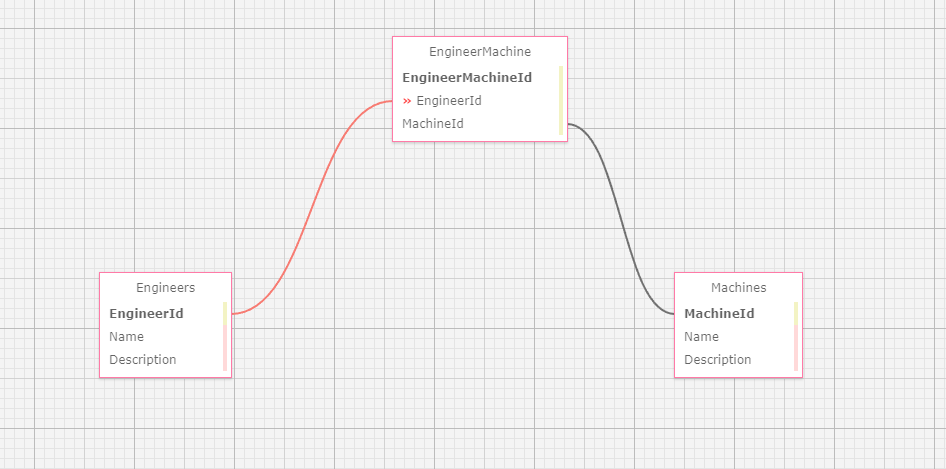

## Factory

## Link to Webpage ##
https://github.com/andrethefirst/Factory.Solution

#### _This is an application for Epicodus that can display Engineers and Machines for a Factory!_

#### By _**Andre Velasquez**_

## Technologies Used

* C#
* .NET 5.0
* Github
* MySqlWorkBench
* Asp .NET CORE MVC

## Schema



## Setup/Installation Requirements

* Clone repository https://github.com/andrethefirst/Factory.Solution
* Open terminal and navigate to Factory
* Run "dotnet restore" to install dependencies
* Download "dotnet ef core version 5.0.10 
* type in dotnet ef database update
* Create appsettings.json file in Factory directory and add this code with your own terms
```
{
  "ConnectionStrings": {
    "DefaultConnection": "Server=localhost;Port=3306;database={first_last};uid={username};pwd={Your_password};"
  }
}
```
* Curly brackets are just for show here. Don't use them in the actual code.
* Navigate to Factory directory and type dotnet run to view to code in a browser
* Make sure you're on the localhost:5000

## Known Bugs

* _No known bugs_

## License

*GNU GENERAL PUBLIC LICENSE
                       Version 3, 29 June 2007

 Copyright (C) 2007 Free Software Foundation, Inc. <http://fsf.org/>
 Everyone is permitted to copy and distribute verbatim copies
 of this license document, but changing it is not allowed.

 _{If you run into any problems, have any questions, or any ideas contact me!}_

 ## Contact Information

 _{email: andrethefirst21@gmail.com}_